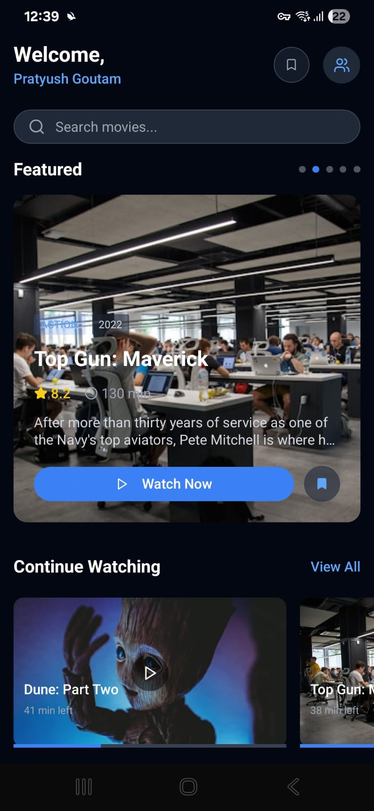

# Movie App

A React Native movie application built with Expo, featuring real-time movie data from TMDB API and secure authentication through Firebase.

## Features

- **Real-time Movie Data**:
  - Trending movies section
  - Popular movies showcase
  - Top-rated movies collection
  - Comprehensive movie details including runtime and ratings
  - Movie search functionality

- **User Features**:
  - Firebase Authentication for secure login/signup
  - Personal watchlist and bookmarks
  - Continue watching progress tracking
  - Watch history

- **Modern UI/UX**:
  - Sleek dark theme interface
  - Carousel for featured movies
  - Category filtering
  - Pull-to-refresh functionality
  - Responsive layout for different devices

## Screenshots

<p align="center">
  
  
  
  
</p>

## Project Structure

```
├── app/                    # Main application screens
│   ├── _layout.tsx        # App layout configuration
│   ├── index.tsx          # Home screen
│   ├── all-movies.tsx     # Movies listing
│   ├── movie-details.tsx  # Movie details screen
│   ├── bookmarks.tsx      # User bookmarks
│   ├── login.tsx          # Authentication screens
│   └── signup.tsx
├── components/            # Reusable components
│   └── ui/               # UI components
├── lib/                  # Core functionality
│   └── tmdb.ts          # TMDB API integration
└── assets/              # Static assets
```

## Setup Instructions

### Prerequisites

- Node.js and npm installed
- TMDB API key (get from [TMDB](https://www.themoviedb.org/settings/api))
- Firebase project setup (create at [Firebase Console](https://console.firebase.google.com/))

### Installation

1. Clone the repository
2. Install dependencies:
```bash
npm install
```

3. Create a `.env` file in the root directory:
```env
TMDB_ACCESS_TOKEN=your_tmdb_access_token
TMDB_API_KEY=your_tmdb_api_key
TMDB_BASE_URL=https://api.themoviedb.org/3
```

4. Start the development server:
```bash
npx expo start
```

## API Integration

The app uses the following TMDB API endpoints:
- Trending movies
- Popular movies
- Top-rated movies
- Movie details
- Movie credits
- Movie videos
- Search functionality

## Contributing

Pull requests are welcome. For major changes, please open an issue first to discuss proposed changes.
